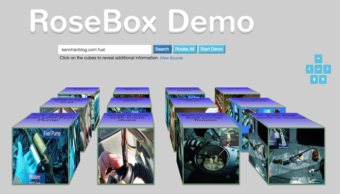

# RoseBox Search Utility
3D Content Search Utility

## Note: Google Search API 1.0 has been discontinued - this demo currently does not work - will require a rewrite to use the new search via API KEYS (if interested, please send me a message for more information).

Hello, my name is Jack and this is a demonstration of a basic 3D content search utility.
At the moment, the app relies on Google Search Image Api 1.0 for sourcing its content.

## Goal
The goal of this demo is to create a starting point (MVP) for content search / aggregator utility
that groups and presents content in visual "tangible" blocks to the end user.

## How To Search Content

Simply enter the search terms inside the search text field and press ENTER or click on the SEARCH button beside it.

Afterwards, the first 4 results will be populated as cubes.  Each consecutive search yields 4 cubes stacking them
closer towards the viewer (you :)).  

## Content Cubes

To view description and title of each cube, you can either click on individual cube to keep rotating it to see
different sides / content OR click on the ROTATE ALL button to rotate all of the cubes at the same time.

The START DEMO button that appears after search rotates the cubes automatically every second.  Its purpose is purely for demonstration of cube grouping at the moment.

Please see screenshot below - this is what it looks like after performing 3 consecutive searches:

New remote control added for moving the cubes in 3D space :)

## Setup & deployment

It is client-side code so there is not much setup involved.  It relies on jQuery, Google Fonts, Bootstrap which
are remotely sourced.  Very plug-n-play.

## Bug Tracking

- Samsung 6s does not perform smooth transitions.

## Bugs & Issues

I came up with this idea quickly and it is very MVPish...

* At the moment there is no alignment routine in place to ensure the cubes are centered to the screen.
* Very minimal validation / error checking.
* No clear-search button.
* No search-recommendations.
* No server-side processing.

yet...

## Compatibility

I have tested it on several versions of Firefox, Safari and Chrome.  I have also tested it on Motorola G2 and ipad
mini.
